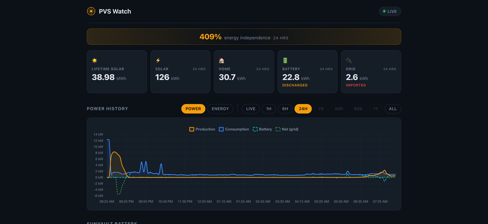
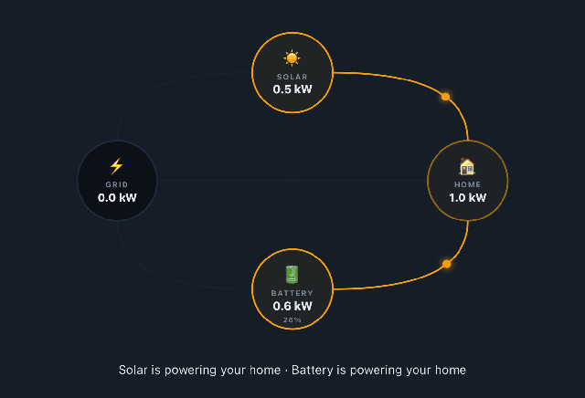
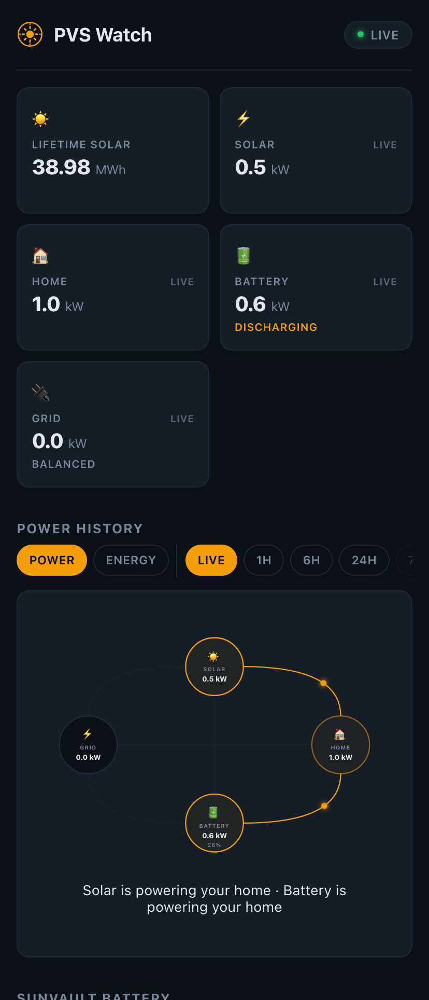

# PVS Watch — Self-Hosted SunPower PVS5/PVS6 Solar Monitor

A self-hosted, single-container web dashboard for SunPower **PVS5 / PVS6** solar gateways. Talks to the gateway over your LAN, records its time-series data to SQLite, and serves a real-time dashboard with charts, per-panel detail, SunVault battery status, and a live energy-flow diagram. No cloud dependency — your data stays on your network.



<table>
<tr>
<td width="60%"></td>
<td width="40%"></td>
</tr>
<tr>
<td align="center"><sub>Live energy-flow diagram (LIVE tab)</sub></td>
<td align="center"><sub>Responsive mobile layout</sub></td>
</tr>
</table>

## Why this exists

In 2024, **SunPower filed for bankruptcy** and was acquired by **SunStrong Management** (Complete Solaria), which now operates the residential fleet. As part of that transition, the legacy **MySunPower web dashboard was retired** and the official mobile app became the only sanctioned interface for homeowners.

The PVS gateway under your stairs/garage still produces excellent local telemetry — it just no longer has a vendor-supported way to view it on a computer. This project fills that gap.

## ⚠️ PVS6 firmware compatibility (read this first)

The PVS6 historically exposed a local HTTP API on a hidden installer access point. SunPower **progressively restricted local API access** in firmware updates throughout 2024, and after the SunStrong acquisition there is **no official path to downgrade firmware**. This monitor only works if your gateway's current firmware still serves the local API.

**Known-working range:** Firmware versions through approximately **2024.04**. Firmware **~2024.06 and later** has been reported to lock down or remove the endpoints this project depends on.

**Test before deploying** — from any machine on the same LAN as the PVS:

```bash
# Replace LAST5 with the last 5 chars of your PVS *internal* serial.
curl -u "ssm_owner:LAST5" http://<PVS_IP>/cgi-bin/dl_cgi/devices/list
```

- ✅ Returns a JSON device list after 30–60 seconds → you're good
- ❌ Returns 401/403/404, hangs, or refuses connection → your firmware likely no longer exposes the local API and this project will not work for you

## Features

- **Real-time hero KPIs** — Lifetime solar, plus Solar / Home / Battery / Grid for the selected window (LIVE / 1H / 6H / 24H / 7D / 30D / 90D / 1Y / ALL)
- **Energy independence %** — `solar_kwh ÷ home_kwh` for the selected window
- **Live power-flow diagram** — Home Assistant-style 4-node SVG with animated dots showing where energy is moving right now
- **POWER ↔ ENERGY chart toggle** — line chart of kW over time, or stacked bar chart of kWh per period
- **SunVault battery section** — state of charge, charge/discharge power, backup-time-remaining
- **Per-panel inverter status** — click a panel for a drill-down chart of its production over day/week/month
- **Savings card** — dollars saved, lbs CO₂ avoided, trees-equivalent, miles-not-driven, gallons-not-used (configurable rate / emissions factor)
- **Nighttime detection** — when DC powerline comms drop after dark, panels report `STATE=error` even though nothing is wrong; the dashboard recognizes this pattern and shows "🌙 Nighttime idle" instead of a red banner
- **Optional Tailscale sidecar** — secure HTTPS access from anywhere on your tailnet without opening a router port

## Architecture

```
Browser ──► (optional Tailscale HTTPS) ──► Flask proxy (5001) ──► PVS gateway (HTTPS)
                                                  │
                                          SQLite history DB
```

- **`proxy.py`** — Flask app: handles HTTP Basic auth against the PVS, caches `/devices` data, runs a background poll thread that records to SQLite, exposes the JSON API the dashboard consumes, and serves the dashboard HTML
- **`solar_dashboard.html`** — Single-file HTML/CSS/JS dashboard (Chart.js for the time-series chart, vanilla SVG for the flow diagram)
- **`docker-compose.yml`** — The monitor container plus an optional Tailscale sidecar
- **SQLite** — `solar_history.db` in the data volume; one row per refresh in `readings`, plus per-panel rows in `panel_readings`

A background thread inside `proxy.py` polls the PVS every `REFRESH_SECS` (default 300s = 5 min). The PVS scan cycle is ~40–60 min so meter values change at most that often, but the `/sys/livedata/` endpoint refreshes every few seconds and is the freshest source for kW readings.

## Quick start

### Prerequisites

- A SunPower **PVS5 or PVS6** with firmware that still exposes the local HTTP API (see compatibility section above)
- Network reachability from the host running this container to the PVS gateway IP
- Docker + Docker Compose
- The PVS internal serial number (see below)

### Find your PVS internal serial number

The PVS auth password is **not** the serial printed on the unit's label — it's the **last 5 characters of the internal serial**. Find it from any LAN-connected machine:

```bash
curl http://<PVS_IP>/cgi-bin/dl_cgi/getvarserver?vars=/sys/info/serialnum
# or:
curl 'http://<PVS_IP>/vars?name=/sys/info/serialnum'
```

The response will look like `ZTxxxxxxxxxxxxxxxxx`. Take the **last 5 characters** — that's your `PVS_PASS`.

### 1. Configure

```bash
cp .env.example .env
# Edit .env and set at minimum:
#   PVS_IP   = your PVS LAN IP (e.g. 192.168.1.50)
#   PVS_PASS = the last 5 chars of the internal serial
```

### 2. Start the container

**Option A — convenience wrapper (recommended):**

```bash
./pvswatch.sh start    # builds and starts
./pvswatch.sh logs     # follow logs
./pvswatch.sh open     # open the dashboard in your browser
```

**Option B — Docker Compose directly:**

```bash
docker compose up -d --build
```

**Option C — pull the prebuilt image** (skip the local build):

A multi-arch (`linux/amd64`, `linux/arm64`) image is published to GitHub Container Registry on every release tag. Edit `docker-compose.yml` to replace the `build: .` line on the `pvswatch` service with:

```yaml
image: ghcr.io/timkatz/pvswatch:latest
```

then:

```bash
docker compose pull && docker compose up -d
```

Pin to a specific release if you'd rather not auto-roll: `ghcr.io/timkatz/pvswatch:2026.04.25.3` (full version), `:2026.04.25` (latest release of that day), or `:2026` (latest of that year).

The dashboard is now at `http://localhost:5001/` (or whatever `DASHBOARD_PORT` you set).

The first request can take 60–90 seconds — the PVS `/devices/list` endpoint is famously slow, and the proxy waits for the first poll to complete before serving data.

### 3. (Optional) HTTPS access from anywhere via Tailscale

The included `tailscale` sidecar in `docker-compose.yml` will expose the dashboard at `https://<TS_HOSTNAME>.<your-tailnet>.ts.net/` from any device on your tailnet. On first run, check the sidecar logs for the auth URL:

```bash
docker logs pvswatch-tailscale
```

If you don't want Tailscale, simply remove or comment out the `tailscale:` service in `docker-compose.yml`.

## Configuration

All settings come from `.env`. Required fields are marked.

| Variable | Default | Description |
|---|---|---|
| `PVS_IP` | — | **Required.** PVS gateway IP on your LAN |
| `PVS_USER` | `ssm_owner` | PVS auth username (always this for SunPower) |
| `PVS_PASS` | — | **Required.** Last 5 chars of internal serial |
| `DASHBOARD_PORT` | `5001` | Host port for the dashboard |
| `TIMEOUT_SECS` | `120` | PVS request timeout (`/devices/list` is slow) |
| `REFRESH_SECS` | `300` | Background poll interval (5 min recommended) |
| `DATA_DIR` | `./data` | Bind-mount path for SQLite + Tailscale state |
| `LOG_LEVEL` | `INFO` | `DEBUG` / `INFO` / `WARNING` / `ERROR` |
| `COST_PER_KWH` | `0.30` | Utility rate ($/kWh) for the Savings card |
| `CO2_LBS_PER_KWH` | `0.85` | Grid emissions factor for the Savings card |
| `TS_HOSTNAME` | `pvswatch` | Tailscale device name (sidecar only) |
| `TS_AUTHKEY` | — | Optional Tailscale auth key for unattended startup |

⚠️ **Polling rate**: don't set `REFRESH_SECS` lower than 300 (5 min). Each poll involves the slow `/devices/list` call (~30–45 s); going faster causes overlapping requests and added load on the gateway.

## API endpoints

The Flask app exposes these JSON endpoints — useful for Home Assistant, Grafana, scripts, etc.

| Endpoint | Description |
|---|---|
| `GET /` | Dashboard HTML |
| `GET /devices` | Latest cached PVS device data; includes a top-level `battery` object (`p_kw`, `soc`, `backup_min`, `lifetime_kwh`) and `grid` object (`p_kw`, `lifetime_kwh`). Sign convention: `battery.p_kw > 0` = discharging; `grid.p_kw > 0` = importing |
| `GET /history?range=24h` | Bucketed time-series + a `period_totals` block (kWh per source, savings, CO₂, independence %, etc.). Ranges: `1h`, `6h`, `24h`, `7d`, `30d`, `90d`, `1y`, `all` |
| `GET /history/panels?range=24h` | Per-panel raw readings for the range (large response) |
| `GET /panel/<serial>/history?range=24h` | Per-panel drilldown: bucketed kWh, latest snapshot, total — used by the dashboard panel modal |
| `GET /health` | Cache freshness, history row count, and `history_earliest` timestamp |

## Database schema

SQLite, two tables, schema created on first start:

- **`readings`** — one row per poll: `production_kw`, `consumption_kw`, `net_kw`, `lifetime_kwh`, voltage / frequency / power-factor, panel health counts, and battery columns (`battery_kw`, `battery_soc`, `backup_min`, `battery_lifetime_kwh`, `home_lifetime_kwh`, `grid_lifetime_kwh`)
- **`panel_readings`** — one row per inverter per poll: `serial`, `model`, `state`, `watts`, DC/AC voltage, current, temperature, `lifetime_kwh`

Schema migrations are idempotent `ALTER TABLE` calls in `_init_db()` — safe to run on existing databases.

**Sign conventions** (verified empirically):
- `net_kw > 0` = importing from grid; `< 0` = exporting (matches PVS `net_p`)
- `battery_kw > 0` = discharging; `< 0` = charging

## Local management script

`pvswatch.sh` is a thin wrapper around `docker compose`:

```
build     Build (or rebuild) the Docker image
start     Start the container (builds first if needed)
stop      Stop and remove the container
restart   Stop and start the container
status    Show container status and recent logs
logs      Follow container logs
url       Print the dashboard URL
open      Open the dashboard in your browser
update    git pull origin and rebuild the container
help      Show this help
```

## Troubleshooting

### "Dashboard not loaded" / 500 on first request
The first poll takes 30–90 s because `/devices/list` is slow. Wait, then refresh.

### 401/403 from the PVS
- Confirm `PVS_PASS` is the **last 5 of the internal serial**, not the label serial
- Confirm you can reach the PVS at `PVS_IP` from the host running the container (`ping`, `curl`)
- Confirm your firmware version still allows local API access (see compatibility section)

### Connection refused / hangs
- Verify the PVS is on the same network and the IP hasn't changed (set a DHCP reservation)
- If using `network_mode: host`, the container shares the host's network — confirm the host can reach the PVS
- Some PVS units only expose the API on the **installer port** (an Ethernet jack inside the unit) rather than the customer-facing LAN; in that case you may need a small Linux box (Raspberry Pi works) attached to that port

### Dashboard shows "🌙 Nighttime idle"
This is normal. SunPower micro-inverters communicate over the DC powerline; once panels stop producing, comms drop and every panel reports `STATE=error`. The dashboard detects this pattern and treats it as expected nighttime behavior.

### Polling is loading my PVS too much
Increase `REFRESH_SECS` in `.env` and restart. The default is 5 min, which is comparable to what the SunPower app does. Don't go below 300.

## Related projects

If PVS Watch's standalone dashboard isn't quite what you're after, the PVS community has built other tools that talk to the same local API and may be a better fit:

- **[smcneece/ha-esunpower](https://github.com/smcneece/ha-esunpower)** — A native Home Assistant integration. If you already run HA, this surfaces production / consumption / battery / per-panel data as HA sensors directly, no proxy in between. PVS Watch and ha-esunpower can run side-by-side against the same PVS without conflict.
- **[thomastech/SunPower-Web-Monitor](https://github.com/thomastech/SunPower-Web-Monitor)** — The original lightweight web monitor that this project descended from.
- **[scott1howard-cba/SunPower-PVS-Exporter](https://github.com/scott1howard-cba/SunPower-PVS-Exporter)** — Prometheus exporter for the PVS local API; pair with Grafana for time-series dashboards.

## Credits

The original PVS dashboard concept was popularized by **[thomastech/SunPower-Web-Monitor](https://github.com/thomastech/SunPower-Web-Monitor)** — early versions of this project started from that codebase. PVS Watch has since diverged significantly (rewritten Flask proxy, SQLite history, SunVault battery support, energy-flow diagram, period-totals API, per-panel drilldown, etc.) but the lineage is acknowledged.

Reverse-engineering of PVS endpoints draws on years of community work in the [SunPower local-API discussions](https://github.com/scott1howard-cba/SunPower-PVS-Exporter/) and various forum threads.

## Contributing

Issues and PRs welcome. If you've successfully tested with a specific firmware version (working *or* not), please open an issue noting your firmware build so we can keep the compatibility section accurate.

## Disclaimer

This project is **not affiliated with, endorsed by, or sponsored by** SunPower Corporation, SunStrong Management, Complete Solaria, or any of their subsidiaries. "SunPower", "PVS", "PVS5", "PVS6", and "SunVault" are trademarks of their respective owners. This is an independent, community-developed monitoring tool. Use at your own risk; the authors accept no liability for any damage to your equipment or warranty implications of accessing the local API.

## License

MIT — see [LICENSE](LICENSE).
